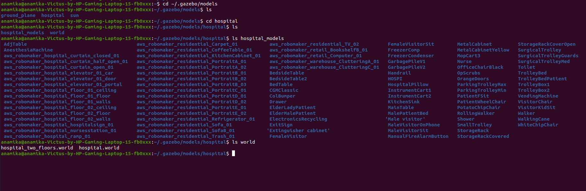

## PC setup

### install-dependent-ros-packages :


```
$ sudo apt-get install ros-noetic-joy ros-noetic-teleop-twist-joy \
  ros-noetic-teleop-twist-keyboard ros-noetic-laser-proc \
  ros-noetic-rgbd-launch ros-noetic-rosserial-arduino \
  ros-noetic-rosserial-python ros-noetic-rosserial-client \
  ros-noetic-rosserial-msgs ros-noetic-amcl ros-noetic-map-server \
  ros-noetic-move-base ros-noetic-urdf ros-noetic-xacro \
  ros-noetic-compressed-image-transport ros-noetic-rqt* ros-noetic-rviz \
  ros-noetic-gmapping ros-noetic-navigation ros-noetic-interactive-markers
  ```

### Install TurtleBot3 packages :
```
$ sudo apt install ros-noetic-dynamixel-sdk
$ sudo apt install ros-noetic-turtlebot3-msgs
$ sudo apt install ros-noetic-turtlebot3
```

## saving the world in gazebo
Copy the model of your world in models directory of gazebo

example :

I have choosen Hospital model from the repo:

https://github.com/mlherd/Dataset-of-Gazebo-Worlds-Models-and-Maps.git



Your gazebo should look like this.


# Visualizing the robot environment using RVIZ


### Launch Simulation World
 Open terminal run the following commands in your workspace 

```
$ export TURTLEBOT3_MODEL=burger
$ export GAZEBO_MODEL_PATH=/home/anamika/.gazebo/models/hospital/hospital_models/
$ roslaunch my_pack turtlebot3_custom_world.launch 
```
### Run SLAM Node
Open a new terminal and run the SLAM node.

```
$ export TURTLEBOT3_MODEL=burger
$ roslaunch turtlebot3_slam turtlebot3_slam.launch slam_methods:=gmapping
```

### Run Teleoperation Node
Open a new terminal and run the teleoperation node

```
$ export TURTLEBOT3_MODEL=burger
$ roslaunch turtlebot3_teleop turtlebot3_teleop_key.launch
```
### Save Map
When the map is created successfully, open a new terminal and save the map using the following command

```
$ rosrun map_server map_saver -f ~/map
```
# Navigation Simulation
### Launch Simulation World

After saving the proper map, exit all terminals. 
Again launch simulation world 
```
$ export TURTLEBOT3_MODEL=burger
$ roslaunch turtlebot3_gazebo turtlebot3_world.launch
```
### Run Navigation Node
Open a new terminal and run the Navigation node.
```
$ export TURTLEBOT3_MODEL=burger
$ roslaunch turtlebot3_navigation turtlebot3_navigation.launch map_file:=$HOME/map.yaml
```
### Estimate Initial Pose
TurtleBot3 has to be correctly located on the map.
1. Click the `2D Pose Estimate` button in the RViz menu.
2. Click on the map where the actual robot is located and drag the large green arrow toward the direction where the robot is facing.
3. Repeat step 1 and 2 until the LDS sensor data is overlayed on the saved map.
4. Launch keyboard teleoperation node to precisely locate the robot on the map.
```
$ roslaunch turtlebot3_teleop turtlebot3_teleop_key.launch
```
5. Move the robot back and forth a bit to collect the surrounding environment information and narrow down the estimated location of the TurtleBot3 on the map which is displayed with tiny green arrows.
6. Terminate the keyboard teleoperation node.

### Set Navigation Goal
1. Click the `2D Nav Goal button` in the RViz menu.
2. Click on the map to set the destination of the robot and drag the green arrow toward the direction where the robot will be facing.

## Vedio Demonstration
[](https://youtu.be/a6adL3_-4CY)


### Notes:
- Replace `my_pack` with your actual ROS package name where applicable.
- Adjust paths (`/home/anamika/.gazebo/models/hospital/hospital_models/`, `$HOME/map.yaml`, etc.) according to your setup.
- Ensure all ROS packages are installed correctly as per the instructions.

This Markdown structure provides clear sections for different setup and simulation steps, making it easier for users to follow and execute. Adjust it further based on specific details or additional instructions you may need to include.
